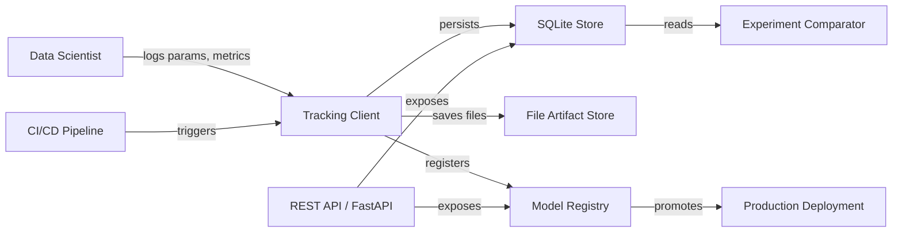

<p align="center">
  <h1 align="center">ML Experiment Tracking Platform</h1>
  <p align="center">Plataforma de Rastreamento de Experimentos de Machine Learning</p>
</p>

<p align="center">
  </a>
  
  
  
  
</p>

---

## Sobre o Projeto / About the Project

**PT-BR:** Uma plataforma completa para rastreamento, comparacao e gerenciamento de experimentos de machine learning. Inspirada em ferramentas como MLflow, esta solucao oferece rastreamento de parametros e metricas, versionamento de modelos com controle de estagio (Staging, Production, Archived), comparacao lado a lado de execucoes experimentais e uma API REST para integracao remota. Tudo construido sobre SQLite para simplicidade e portabilidade, sem dependencias de infraestrutura pesada.

**EN:** A full-featured platform for tracking, comparing, and managing machine learning experiments. Inspired by tools like MLflow, it provides parameter and metric logging, model versioning with stage management (Staging, Production, Archived), side-by-side run comparison, and a REST API for remote integration. Built on top of SQLite for simplicity and portability, with no heavyweight infrastructure dependencies.

---

## Arquitetura / Architecture



---

## Funcionalidades / Features

**PT-BR:**
- Gerenciamento de experimentos com nome, descricao e tags
- Rastreamento de execucoes com status (RUNNING, COMPLETED, FAILED)
- Registro de parametros, metricas e artefatos por execucao
- Armazenamento de artefatos em sistema de arquivos local
- Registro de modelos com versionamento automatico
- Transicao de estagios: None, Staging, Production, Archived
- Comparacao lado a lado de multiplas execucoes
- Ranking de modelos por metrica
- API REST completa com FastAPI
- Autolog para modelos scikit-learn
- Persistencia em SQLite (stdlib, sem servidor)
- Docker e CI/CD prontos para uso

**EN:**
- Experiment management with name, description, and tags
- Run tracking with status lifecycle (RUNNING, COMPLETED, FAILED)
- Per-run parameter, metric, and artifact logging
- Local file system artifact storage
- Model registry with automatic versioning
- Stage transitions: None, Staging, Production, Archived
- Side-by-side comparison of multiple runs
- Model ranking by metric
- Full REST API powered by FastAPI
- Autolog for scikit-learn models
- SQLite persistence (stdlib, no server required)
- Docker and CI/CD ready

---

## Estrutura do Projeto / Project Structure

```
ml-experiment-tracking-platform/
|-- src/
|   |-- api/             # REST API (FastAPI)
|   |-- comparison/      # Run comparison & ranking
|   |-- config/          # Platform settings
|   |-- models/          # Domain dataclasses
|   |-- registry/        # Model registry & versioning
|   |-- storage/         # SQLite + file artifact stores
|   |-- tracking/        # Experiment/run managers & client
|   |-- utils/           # Logging utilities
|-- tests/               # Unit & integration tests
|-- config/              # YAML configuration
|-- docker/              # Dockerfile & docker-compose
|-- main.py              # Complete demo script
|-- requirements.txt
|-- Makefile
```

---

## Inicio Rapido / Quick Start

### Instalacao / Installation

```bash
git clone https://github.com/galafis/ml-experiment-tracking-platform.git
cd ml-experiment-tracking-platform
pip install -r requirements.txt
```

### Executar o Demo / Run the Demo

```bash
python main.py
```

### Iniciar a API / Start the API

```bash
uvicorn src.api.server:app --host 0.0.0.0 --port 8000 --reload
```

A documentacao interativa fica disponivel em `http://localhost:8000/docs`.

Interactive docs are available at `http://localhost:8000/docs`.

### Docker

```bash
docker-compose -f docker/docker-compose.yml up -d
```

---

## Exemplo de Uso / Usage Example

```python
from src.tracking.client import TrackingClient
from src.comparison.comparator import ExperimentComparator
from src.registry.model_registry import ModelRegistry, ModelStage

# Initialize
client = TrackingClient(db_path="./tracking.db", artifact_root="./artifacts")

# Create experiment
experiment = client.create_experiment(
    name="house_price_prediction",
    description="Compare regression models for house price estimation",
)

# Train and track a model
from sklearn.linear_model import LinearRegression

with client.start_run(experiment.id, "linear_regression") as run:
    run.log_params({"fit_intercept": True, "model_type": "linear"})

    model = LinearRegression()
    model.fit(X_train, y_train)

    predictions = model.predict(X_test)
    run.log_metrics({"rmse": 15.23, "r2": 0.87, "mae": 11.05})

    client.log_model(model, "LinearRegression")
```

### Saida da Comparacao / Comparison Output

Ao executar o demo completo com tres modelos, a plataforma produz uma tabela de comparacao como esta:

When running the full demo with three models, the platform produces a comparison table like this:

```
+-------------------+-----------+------------+--------------+-----------+---------------+--------+--------+--------+
| Run Name          | Status    | model_type | n_estimators | max_depth | learning_rate | rmse   | mae    | r2     |
+-------------------+-----------+------------+--------------+-----------+---------------+--------+--------+--------+
| LinearRegression  | completed | linear     | -            | -         | -             | 15.561 | 12.395 | 0.9717 |
| RandomForest      | completed | ensemble   | 100          | 10        | -             | 16.948 | 12.831 | 0.9664 |
| GradientBoosting  | completed | boosting   | 200          | 5         | 0.1           | 14.867 | 11.670 | 0.9742 |
+-------------------+-----------+------------+--------------+-----------+---------------+--------+--------+--------+

Model Ranking by R2 (higher is better):
  #1 GradientBoosting          R2 = 0.9742
  #2 LinearRegression          R2 = 0.9717
  #3 RandomForest              R2 = 0.9664
```

---

## API Endpoints

| Method | Endpoint                                   | Descricao / Description            |
|--------|--------------------------------------------|------------------------------------|
| GET    | `/health`                                  | Health check                       |
| POST   | `/experiments`                             | Criar experimento / Create experiment |
| GET    | `/experiments`                             | Listar experimentos / List experiments |
| GET    | `/experiments/{id}`                        | Obter experimento / Get experiment |
| DELETE | `/experiments/{id}`                        | Deletar experimento / Delete experiment |
| POST   | `/runs`                                    | Iniciar execucao / Start run       |
| GET    | `/runs/{id}`                               | Obter execucao / Get run           |
| PUT    | `/runs/{id}/end`                           | Finalizar execucao / End run       |
| GET    | `/experiments/{id}/runs`                   | Execucoes do experimento / Experiment runs |
| POST   | `/runs/{id}/params`                        | Registrar parametro / Log parameter |
| POST   | `/runs/{id}/metrics`                       | Registrar metrica / Log metric     |
| POST   | `/models`                                  | Registrar modelo / Register model  |
| GET    | `/models`                                  | Listar modelos / List models       |
| GET    | `/models/{name}`                           | Obter modelo / Get model           |
| GET    | `/models/{name}/versions`                  | Versoes do modelo / Model versions |
| PUT    | `/models/{name}/versions/{ver}/stage`      | Transicao de estagio / Transition stage |
| POST   | `/compare`                                 | Comparar execucoes / Compare runs  |
| GET    | `/experiments/{id}/best`                   | Melhor execucao / Best run         |

---

## Aplicacoes na Industria / Industry Applications

**PT-BR:**

- **Colaboracao em Equipes de ML:** Equipes de ciencia de dados podem rastrear e compartilhar resultados experimentais de forma centralizada, evitando a perda de informacoes e facilitando a reproducibilidade de resultados.

- **Governanca de Modelos:** O registro de modelos com versionamento e controle de estagio garante que apenas modelos devidamente validados cheguem a producao, atendendo requisitos de auditoria e compliance.

- **Rastreamento de Testes A/B:** Campanhas de testes A/B podem ser gerenciadas como experimentos, com metricas de negocio registradas por variante para facilitar a tomada de decisao baseada em dados.

- **Otimizacao de Hiperparametros:** A comparacao automatizada de execucoes permite identificar rapidamente as melhores combinacoes de hiperparametros, acelerando o ciclo de desenvolvimento de modelos.

- **Gerenciamento de Modelos em Producao:** O fluxo de estagio (Staging, Production, Archived) facilita o deploy controlado de modelos, com rollback simples em caso de degradacao de performance.

**EN:**

- **ML Team Collaboration:** Data science teams can track and share experimental results centrally, preventing information loss and enabling result reproducibility.

- **Model Governance:** The model registry with versioning and stage control ensures that only properly validated models reach production, meeting audit and compliance requirements.

- **A/B Testing Tracking:** A/B test campaigns can be managed as experiments, with business metrics logged per variant for data-driven decision-making.

- **Hyperparameter Optimization:** Automated run comparison quickly identifies the best hyperparameter combinations, speeding up the model development cycle.

- **Production Model Management:** The stage workflow (Staging, Production, Archived) enables controlled model deployment, with straightforward rollback if performance degrades.

---

## Testes / Testing

```bash
# Run all tests
python -m pytest tests/ -v --tb=short --cov=src

# Run specific test module
python -m pytest tests/unit/test_sqlite_store.py -v
```

---

## Tecnologias / Technologies

- **Python 3.10+**
- **SQLite** (stdlib) — persistent storage
- **FastAPI** — REST API
- **scikit-learn** — ML models and metrics
- **NumPy** — numerical computation
- **Pydantic** — data validation
- **pytest** — testing framework
- **Docker** — containerization

---

## Autor / Author

**Gabriel Demetrios Lafis**

---

## Licenca / License

This project is licensed under the MIT License. See the [LICENSE](LICENSE) file for details.

Este projeto esta licenciado sob a Licenca MIT. Consulte o arquivo [LICENSE](LICENSE) para mais detalhes.
