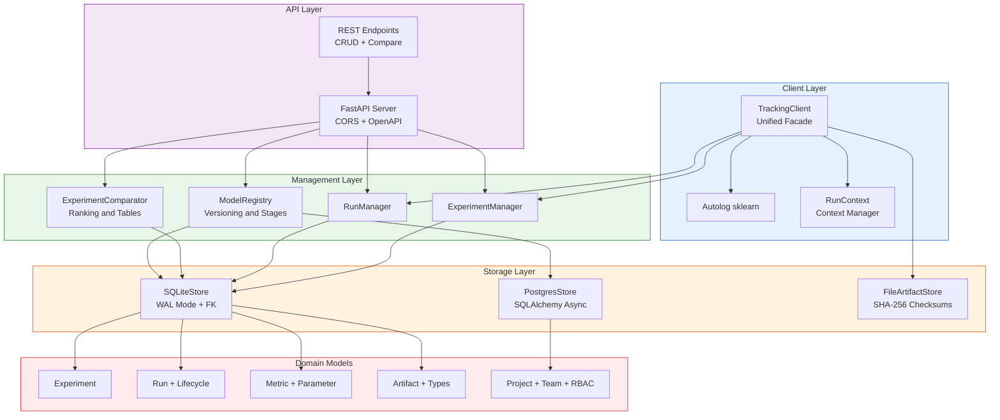
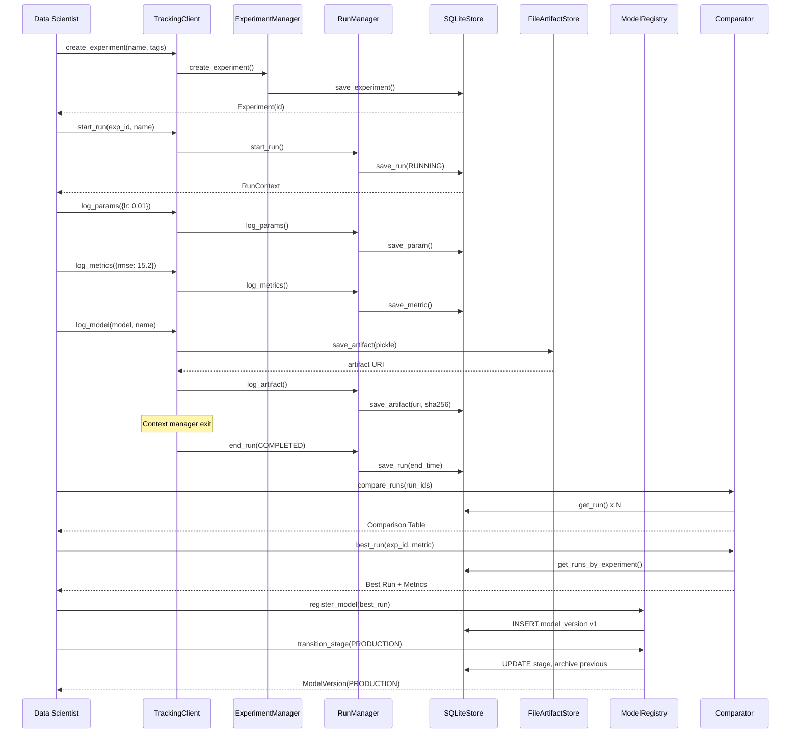

<h1 align="center">ML Experiment Tracking Platform</h1>

<p align="center">
  <strong>Plataforma de Rastreamento de Experimentos de Machine Learning</strong>
</p>

<p align="center">
  
  
  
  
  
  
  
</p>

<p align="center">
  <a href="#portugu%C3%AAs">Portugues</a> | <a href="#english">English</a>
</p>

---

## Portugues

### Sobre

Plataforma completa e extensivel para rastreamento, comparacao e gerenciamento de experimentos de machine learning, inspirada em ferramentas como MLflow e Weights & Biases. O sistema fornece uma infraestrutura robusta para equipes de ciencia de dados que precisam registrar parametros, metricas e artefatos de forma centralizada, versionar modelos com controle de estagio de deployment (None, Staging, Production, Archived) e comparar execucoes experimentais lado a lado com ranking automatico por metrica.

A arquitetura segue principios de separacao de responsabilidades com camadas bem definidas: dominio (dataclasses imutaveis), armazenamento (SQLite com WAL mode + PostgreSQL async), gerenciamento (experiment/run managers), registro de modelos com versionamento automatico, e uma API REST completa via FastAPI com documentacao OpenAPI interativa. O backend SQLite utiliza Write-Ahead Logging para performance concorrente, foreign keys para integridade referencial, e indices otimizados para consultas por metrica. Um backend PostgreSQL com SQLAlchemy async esta disponivel para cenarios de producao com alta concorrencia.

### Tecnologias

| Camada | Tecnologia | Finalidade |
|---|---|---|
| Linguagem | Python 3.10+ | Runtime principal com type hints modernos |
| API REST | FastAPI 0.104+ | Endpoints HTTP com validacao Pydantic e docs OpenAPI |
| Armazenamento | SQLite (WAL) | Persistencia local leve, zero-config |
| Armazenamento | PostgreSQL + SQLAlchemy | Backend async para producao distribuida |
| ML Framework | scikit-learn 1.3+ | Modelos de regressao/classificacao e autolog |
| Validacao | Pydantic 2.5+ | Schemas de request/response e settings |
| Computacao | NumPy 1.24+ | Operacoes numericas e calculo de metricas |
| Testes | pytest + pytest-cov | Testes unitarios e de integracao com cobertura |
| HTTP Client | httpx 0.25+ | Cliente HTTP async para testes de API |
| Linting | Ruff + Black + mypy | Formatacao, linting e verificacao de tipos |
| Container | Docker + Docker Compose | Implantacao containerizada com health check |
| Config | Pydantic Settings + YAML | Configuracao hierarquica com env vars |

### Arquitetura


### Fluxo de Rastreamento


### Estrutura do Projeto

```
ml-experiment-tracking-platform/
├── src/
│   ├── api/
│   │   ├── __init__.py
│   │   └── server.py                 # FastAPI REST API (381 LOC)
│   ├── comparison/
│   │   ├── __init__.py
│   │   └── comparator.py             # Comparacao e ranking (283 LOC)
│   ├── config/
│   │   ├── __init__.py
│   │   └── settings.py               # Pydantic Settings multi-backend (157 LOC)
│   ├── models/
│   │   ├── __init__.py
│   │   ├── experiment.py              # Dominio: Experiment, Run, Metric (382 LOC)
│   │   └── project.py                # Dominio: Project, Team, RBAC (225 LOC)
│   ├── registry/
│   │   ├── __init__.py
│   │   └── model_registry.py         # Registro e versionamento (383 LOC)
│   ├── storage/
│   │   ├── __init__.py
│   │   ├── sqlite_store.py           # Backend SQLite WAL (468 LOC)
│   │   ├── postgres_store.py         # Backend PostgreSQL async (632 LOC)
│   │   └── file_store.py             # Artefatos locais + SHA-256 (184 LOC)
│   ├── tracking/
│   │   ├── __init__.py
│   │   ├── client.py                 # Facade unificada + autolog (431 LOC)
│   │   ├── experiment.py             # Gerenciador de experimentos (160 LOC)
│   │   └── run.py                    # Gerenciador de execucoes (199 LOC)
│   ├── utils/
│   │   ├── __init__.py
│   │   └── logger.py                 # Logging estruturado (129 LOC)
│   ├── cli/
│   │   └── __init__.py
│   ├── sdk/
│   │   └── __init__.py
│   ├── versioning/
│   │   └── __init__.py
│   └── __init__.py
├── tests/
│   ├── conftest.py                    # Fixtures compartilhadas (75 LOC)
│   ├── unit/
│   │   ├── test_sqlite_store.py       # Testes CRUD SQLite (154 LOC)
│   │   ├── test_tracking_client.py    # Testes do client (93 LOC)
│   │   ├── test_api.py               # Testes da API REST (126 LOC)
│   │   ├── test_comparator.py        # Testes de comparacao (93 LOC)
│   │   ├── test_file_store.py        # Testes de artefatos (66 LOC)
│   │   └── test_model_registry.py    # Testes do registro (100 LOC)
│   └── integration/
│       └── __init__.py
├── config/
│   └── tracking_config.yaml           # Configuracao YAML
├── docker/
│   ├── Dockerfile                     # Build otimizado com health check
│   └── docker-compose.yml             # Orquestracao com volumes
├── main.py                            # Demo completo end-to-end (244 LOC)
├── Dockerfile                         # Build de producao
├── Makefile                           # Automacao de tarefas
├── requirements.txt                   # Dependencias pinadas
├── .env.example                       # Variaveis de ambiente
├── .gitignore
└── LICENSE                            # MIT
```

**Total: ~4,500+ linhas de codigo Python**

### Quick Start

```bash
# Clonar o repositorio
git clone https://github.com/galafis/ml-experiment-tracking-platform.git
cd ml-experiment-tracking-platform

# Criar ambiente virtual
python -m venv venv
source venv/bin/activate  # Linux/macOS
# venv\Scripts\activate   # Windows

# Instalar dependencias
pip install -r requirements.txt

# Executar o demo completo
python main.py
```

### Docker

```bash
# Build e execucao com Docker Compose
docker-compose -f docker/docker-compose.yml up -d

# Ou build direto
docker build -t ml-tracking-platform .
docker run -p 8000:8000 -v tracking-data:/app/data ml-tracking-platform

# Verificar saude do servico
curl http://localhost:8000/health
```

### Iniciar a API REST

```bash
# Modo desenvolvimento com hot reload
uvicorn src.api.server:app --host 0.0.0.0 --port 8000 --reload

# Documentacao interativa
# http://localhost:8000/docs (Swagger UI)
# http://localhost:8000/redoc (ReDoc)
```

### Testes

```bash
# Executar todos os testes com cobertura
python -m pytest tests/ -v --tb=short --cov=src --cov-report=term-missing

# Executar testes especificos
python -m pytest tests/unit/test_sqlite_store.py -v
python -m pytest tests/unit/test_api.py -v

# Linting e type checking
ruff check src/ tests/
mypy src/ --ignore-missing-imports
```

### Benchmarks

| Operacao | Volume | Tempo Medio | Observacoes |
|---|---|---|---|
| Criar Experimento | 1 | < 1 ms | SQLite WAL mode |
| Iniciar Run | 1 | < 2 ms | Com persist + index |
| Log 100 Metricas | batch | < 15 ms | INSERT sequencial |
| Log 50 Parametros | batch | < 10 ms | Upsert com DELETE+INSERT |
| Comparar 10 Runs | side-by-side | < 25 ms | JOIN + aggregation |
| Ranking 100 Runs | por metrica | < 50 ms | Sort in-memory |
| Registrar Modelo | 1 versao | < 5 ms | Auto-increment version |
| Transicao de Stage | 1 | < 3 ms | Archive + promote |
| Serializar Modelo | ~50 KB | < 100 ms | pickle + SHA-256 |
| Health Check API | GET /health | < 1 ms | JSON response |

### API Endpoints

| Metodo | Endpoint | Descricao |
|---|---|---|
| `GET` | `/health` | Verificacao de saude do servico |
| `POST` | `/experiments` | Criar novo experimento |
| `GET` | `/experiments` | Listar todos os experimentos |
| `GET` | `/experiments/{id}` | Obter experimento por ID |
| `DELETE` | `/experiments/{id}` | Deletar experimento e runs |
| `POST` | `/runs` | Iniciar nova execucao |
| `GET` | `/runs/{id}` | Obter execucao por ID |
| `PUT` | `/runs/{id}/end` | Finalizar execucao |
| `GET` | `/experiments/{id}/runs` | Listar runs do experimento |
| `POST` | `/runs/{id}/params` | Registrar parametro |
| `POST` | `/runs/{id}/params/batch` | Registrar parametros em lote |
| `POST` | `/runs/{id}/metrics` | Registrar metrica |
| `POST` | `/runs/{id}/metrics/batch` | Registrar metricas em lote |
| `POST` | `/models` | Registrar versao de modelo |
| `GET` | `/models` | Listar modelos registrados |
| `GET` | `/models/{name}` | Obter modelo (latest ou versao) |
| `GET` | `/models/{name}/versions` | Listar versoes do modelo |
| `PUT` | `/models/{name}/versions/{ver}/stage` | Transicao de estagio |
| `POST` | `/compare` | Comparar runs lado a lado |
| `GET` | `/experiments/{id}/best` | Melhor run por metrica |

### Aplicabilidade na Industria

| Setor | Caso de Uso | Beneficio |
|---|---|---|
| **Financas** | Rastreamento de modelos de risco de credito e deteccao de fraude com versionamento de stages | Auditoria completa, compliance regulatorio e rollback controlado |
| **Saude** | Comparacao de modelos de diagnostico medico com metricas de sensibilidade/especificidade | Reproducibilidade de resultados clinicos e governanca de modelos |
| **E-commerce** | Gerenciamento de modelos de recomendacao e previsao de churn com testes A/B | Deploy gradual com stage management e metricas de negocio por variante |
| **Manufatura** | Rastreamento de modelos de manutencao preditiva com series temporais de sensores | Historico completo de parametros e metricas para otimizacao continua |
| **Telecomunicacoes** | Otimizacao de hiperparametros para modelos de previsao de demanda de rede | Comparacao automatizada de centenas de runs para identificar melhor config |
| **Seguros** | Versionamento de modelos atuariais com controle de estagio para producao | Transicao segura None-Staging-Production com archive automatico |
| **Marketing** | Tracking de campanhas de ML para segmentacao de clientes e lead scoring | Registro centralizado de metricas por campanha com ranking automatico |

### Autor

**Gabriel Demetrios Lafis**

[](https://github.com/galafis)
[](https://www.linkedin.com/in/gabriel-demetrios-lafis)

### Licenca

Este projeto esta licenciado sob a Licenca MIT. Consulte o arquivo [LICENSE](LICENSE) para mais detalhes.

---

## English

### About

A complete and extensible platform for tracking, comparing, and managing machine learning experiments, inspired by tools like MLflow and Weights & Biases. The system provides robust infrastructure for data science teams that need to log parameters, metrics, and artifacts centrally, version models with deployment stage control (None, Staging, Production, Archived), and compare experimental runs side by side with automatic metric-based ranking.

The architecture follows separation-of-concerns principles with well-defined layers: domain (immutable dataclasses), storage (SQLite with WAL mode + async PostgreSQL), management (experiment/run managers), model registry with automatic versioning, and a full REST API via FastAPI with interactive OpenAPI documentation. The SQLite backend uses Write-Ahead Logging for concurrent performance, foreign keys for referential integrity, and optimized indexes for metric-based queries. A PostgreSQL backend with SQLAlchemy async is available for production scenarios with high concurrency.

### Technologies

| Layer | Technology | Purpose |
|---|---|---|
| Language | Python 3.10+ | Main runtime with modern type hints |
| REST API | FastAPI 0.104+ | HTTP endpoints with Pydantic validation and OpenAPI docs |
| Storage | SQLite (WAL) | Lightweight zero-config local persistence |
| Storage | PostgreSQL + SQLAlchemy | Async backend for distributed production |
| ML Framework | scikit-learn 1.3+ | Regression/classification models and autolog |
| Validation | Pydantic 2.5+ | Request/response schemas and settings |
| Computation | NumPy 1.24+ | Numerical operations and metric computation |
| Testing | pytest + pytest-cov | Unit and integration tests with coverage |
| HTTP Client | httpx 0.25+ | Async HTTP client for API tests |
| Linting | Ruff + Black + mypy | Formatting, linting, and type checking |
| Container | Docker + Docker Compose | Containerized deployment with health check |
| Config | Pydantic Settings + YAML | Hierarchical configuration with env vars |

### Architecture



### Tracking Flow



### Project Structure

```
ml-experiment-tracking-platform/
├── src/
│   ├── api/
│   │   ├── __init__.py
│   │   └── server.py                 # FastAPI REST API (381 LOC)
│   ├── comparison/
│   │   ├── __init__.py
│   │   └── comparator.py             # Comparison and ranking (283 LOC)
│   ├── config/
│   │   ├── __init__.py
│   │   └── settings.py               # Pydantic Settings multi-backend (157 LOC)
│   ├── models/
│   │   ├── __init__.py
│   │   ├── experiment.py              # Domain: Experiment, Run, Metric (382 LOC)
│   │   └── project.py                # Domain: Project, Team, RBAC (225 LOC)
│   ├── registry/
│   │   ├── __init__.py
│   │   └── model_registry.py         # Registry and versioning (383 LOC)
│   ├── storage/
│   │   ├── __init__.py
│   │   ├── sqlite_store.py           # SQLite WAL backend (468 LOC)
│   │   ├── postgres_store.py         # Async PostgreSQL backend (632 LOC)
│   │   └── file_store.py             # Local artifacts + SHA-256 (184 LOC)
│   ├── tracking/
│   │   ├── __init__.py
│   │   ├── client.py                 # Unified facade + autolog (431 LOC)
│   │   ├── experiment.py             # Experiment manager (160 LOC)
│   │   └── run.py                    # Run manager (199 LOC)
│   ├── utils/
│   │   ├── __init__.py
│   │   └── logger.py                 # Structured logging (129 LOC)
│   ├── cli/
│   │   └── __init__.py
│   ├── sdk/
│   │   └── __init__.py
│   ├── versioning/
│   │   └── __init__.py
│   └── __init__.py
├── tests/
│   ├── conftest.py                    # Shared fixtures (75 LOC)
│   ├── unit/
│   │   ├── test_sqlite_store.py       # SQLite CRUD tests (154 LOC)
│   │   ├── test_tracking_client.py    # Client tests (93 LOC)
│   │   ├── test_api.py               # REST API tests (126 LOC)
│   │   ├── test_comparator.py        # Comparison tests (93 LOC)
│   │   ├── test_file_store.py        # Artifact tests (66 LOC)
│   │   └── test_model_registry.py    # Registry tests (100 LOC)
│   └── integration/
│       └── __init__.py
├── config/
│   └── tracking_config.yaml           # YAML configuration
├── docker/
│   ├── Dockerfile                     # Optimized build with health check
│   └── docker-compose.yml             # Orchestration with volumes
├── main.py                            # Full end-to-end demo (244 LOC)
├── Dockerfile                         # Production build
├── Makefile                           # Task automation
├── requirements.txt                   # Pinned dependencies
├── .env.example                       # Environment variables
├── .gitignore
└── LICENSE                            # MIT
```

**Total: ~4,500+ lines of Python code**

### Quick Start

```bash
# Clone the repository
git clone https://github.com/galafis/ml-experiment-tracking-platform.git
cd ml-experiment-tracking-platform

# Create virtual environment
python -m venv venv
source venv/bin/activate  # Linux/macOS
# venv\Scripts\activate   # Windows

# Install dependencies
pip install -r requirements.txt

# Run the full demo
python main.py
```

### Docker

```bash
# Build and run with Docker Compose
docker-compose -f docker/docker-compose.yml up -d

# Or build directly
docker build -t ml-tracking-platform .
docker run -p 8000:8000 -v tracking-data:/app/data ml-tracking-platform

# Check service health
curl http://localhost:8000/health
```

### Start the REST API

```bash
# Development mode with hot reload
uvicorn src.api.server:app --host 0.0.0.0 --port 8000 --reload

# Interactive documentation
# http://localhost:8000/docs (Swagger UI)
# http://localhost:8000/redoc (ReDoc)
```

### Tests

```bash
# Run all tests with coverage
python -m pytest tests/ -v --tb=short --cov=src --cov-report=term-missing

# Run specific tests
python -m pytest tests/unit/test_sqlite_store.py -v
python -m pytest tests/unit/test_api.py -v

# Linting and type checking
ruff check src/ tests/
mypy src/ --ignore-missing-imports
```

### Benchmarks

| Operation | Volume | Avg Time | Notes |
|---|---|---|---|
| Create Experiment | 1 | < 1 ms | SQLite WAL mode |
| Start Run | 1 | < 2 ms | With persist + index |
| Log 100 Metrics | batch | < 15 ms | Sequential INSERT |
| Log 50 Parameters | batch | < 10 ms | Upsert via DELETE+INSERT |
| Compare 10 Runs | side-by-side | < 25 ms | JOIN + aggregation |
| Rank 100 Runs | by metric | < 50 ms | In-memory sort |
| Register Model | 1 version | < 5 ms | Auto-increment version |
| Stage Transition | 1 | < 3 ms | Archive + promote |
| Serialize Model | ~50 KB | < 100 ms | pickle + SHA-256 |
| Health Check API | GET /health | < 1 ms | JSON response |

### API Endpoints

| Method | Endpoint | Description |
|---|---|---|
| `GET` | `/health` | Service health check |
| `POST` | `/experiments` | Create new experiment |
| `GET` | `/experiments` | List all experiments |
| `GET` | `/experiments/{id}` | Get experiment by ID |
| `DELETE` | `/experiments/{id}` | Delete experiment and runs |
| `POST` | `/runs` | Start new run |
| `GET` | `/runs/{id}` | Get run by ID |
| `PUT` | `/runs/{id}/end` | End run |
| `GET` | `/experiments/{id}/runs` | List experiment runs |
| `POST` | `/runs/{id}/params` | Log parameter |
| `POST` | `/runs/{id}/params/batch` | Batch log parameters |
| `POST` | `/runs/{id}/metrics` | Log metric |
| `POST` | `/runs/{id}/metrics/batch` | Batch log metrics |
| `POST` | `/models` | Register model version |
| `GET` | `/models` | List registered models |
| `GET` | `/models/{name}` | Get model (latest or version) |
| `GET` | `/models/{name}/versions` | List model versions |
| `PUT` | `/models/{name}/versions/{ver}/stage` | Transition stage |
| `POST` | `/compare` | Compare runs side by side |
| `GET` | `/experiments/{id}/best` | Best run by metric |

### Industry Applicability

| Sector | Use Case | Benefit |
|---|---|---|
| **Finance** | Credit risk model tracking and fraud detection with stage versioning | Complete audit trail, regulatory compliance, and controlled rollback |
| **Healthcare** | Comparison of diagnostic models with sensitivity/specificity metrics | Clinical result reproducibility and model governance |
| **E-commerce** | Recommendation and churn prediction model management with A/B testing | Gradual deployment with stage management and per-variant business metrics |
| **Manufacturing** | Predictive maintenance model tracking with sensor time series | Complete parameter and metric history for continuous optimization |
| **Telecom** | Hyperparameter optimization for network demand forecasting models | Automated comparison of hundreds of runs to identify best configuration |
| **Insurance** | Actuarial model versioning with production stage control | Safe None-Staging-Production transition with automatic archiving |
| **Marketing** | ML campaign tracking for customer segmentation and lead scoring | Centralized metric logging per campaign with automatic ranking |

### Author

**Gabriel Demetrios Lafis**

[](https://github.com/galafis)
[](https://www.linkedin.com/in/gabriel-demetrios-lafis)

### License

This project is licensed under the MIT License. See the [LICENSE](LICENSE) file for details.
